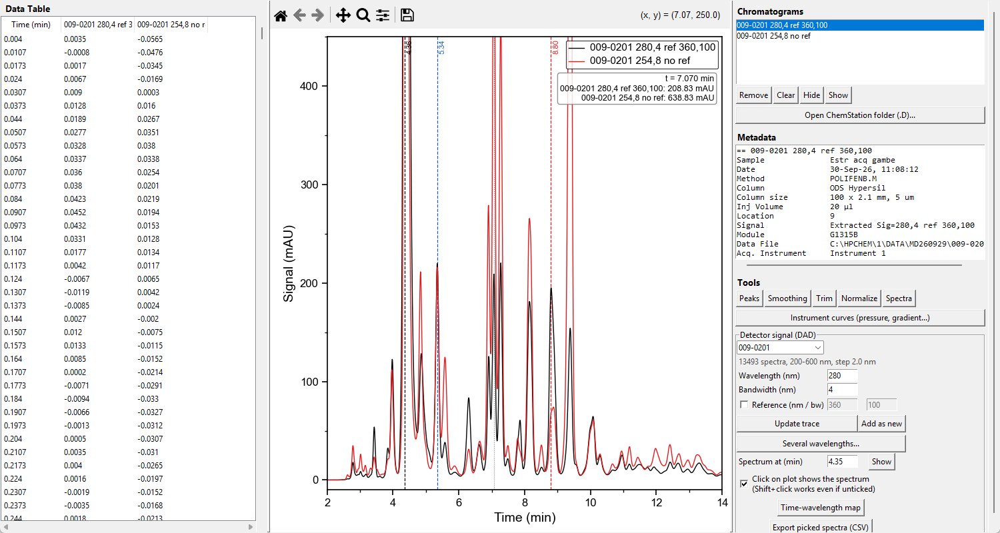
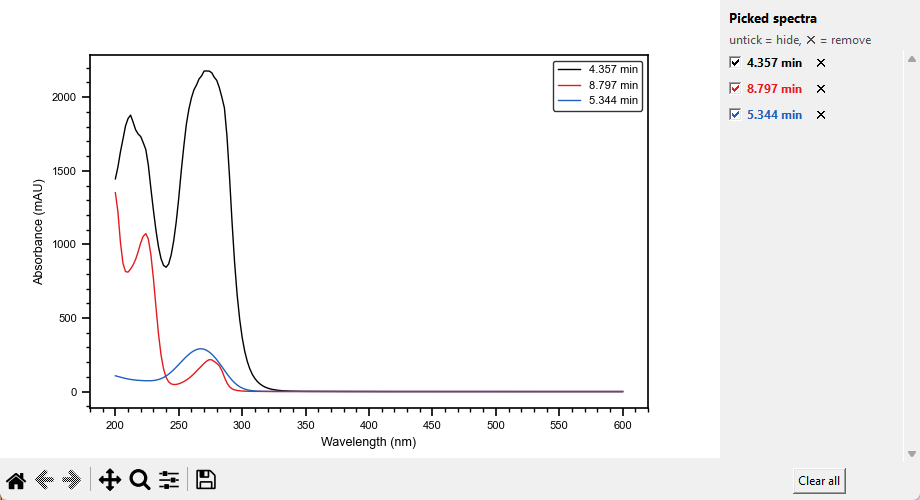

# HPLCManager

Viewer for Agilent ChemStation HPLC-DAD data. Open a raw `.D` folder and **extract chromatograms at any
wavelength after the acquisition** - the full DAD spectra are in the folder, so you are not limited to
the signals chosen before the run. Click on the chromatogram to see the spectrum at that retention
time, look at the pressure and gradient the instrument recorded, integrate peaks and export everything.





## What it does

**Open a ChemStation `.D` folder** (File menu, button, or drag-and-drop with `tkinterdnd2`, not tested). Its DAD spectra
(`.uv`) are loaded and one extracted trace is shown; the signals recorded by the instrument (`.ch`) are
loaded only if File -> "Also load recorded channels" is ticked.

**Detector signal panel.** Set wavelength, bandwidth and an optional reference band (checkbox off = no
reference). Enter or *Update trace* recomputes the extracted trace selected in the list; *Add as new* creates another
one, which becomes the selected one. Click a trace in the list and its wavelength, bandwidth and reference
come back into the panel, ready to edit.
*Several wavelengths...* opens a dialog: choose how many traces you want and, for each, wavelength,
bandwidth and an optional reference (every row has its own); all are extracted in one go.

**Spectra.** Click on the chromatogram (also while the toolbar's zoom/pan is active; dragging still
zooms/pans; Shift+click works even with the checkbox off) to see the spectrum at that time. A dashed line
marks each picked time. In the spectra window a list on the right lets you untick a spectrum to hide it
(its dashed line and the CSV export follow) or remove it with the cross. A time-wavelength map is also
available.

**Peaks.** Detection and integration with a table (RT, height, area, area %); red triangles mark the peaks
ChemStation reported, for comparison. Also Smoothing (Savitzky-Golay), Trim, Normalize.

**Instrument data.** The metadata panel shows the sample, method, column (description, size, particle
size) and the instrument modules, read from `ACQRES.REG`. *Instrument curves* plots what the instrument
recorded during the run, from `LCDIAG.REG`: pressure, solvent composition (gradient), flow and column
temperature, on a common time axis.

**Saving and exporting** (File menu): *Save/Open Session* (`.hplcsession`: all traces, derived ones
included, peaks, DAD spectra and instrument curves); *Export Traces* (merged CSV); *Export Peaks*
(HPLCManager and ChemStation peaks, one per row, with a Source column); *Export Spectra* (the spectra
picked on the plot); *Export Full DAD Data* (time x wavelength matrix); *Export Instrument Curves*
(slower signals interpolated onto the pump time base); *Save Figure Image* (PNG/PDF/SVG, 300 dpi);
*Save Figure (pickle)* and *Edit Figure...* with the shared PlotStyleKit editor. Figures and images
leave out the cursor and the dashed lines of the picked spectra.

## Supported data and limits

ChemStation `.ch` version 30, DAD `.uv` version 31, and the `LCDIAG.REG` / `ACQRES.REG` registers, all
decoded natively (no external tools; format notes in `CLAUDE.md`), plus two-column CSV.

These formats were worked out from **one** ChemStation Rev. A.10.02 run (1100 series, DAD G1315B, 200-600 nm
at 2 nm). Other ChemStation versions, detectors or methods may not load; if a folder does not, open an
issue with the file names and sizes. Known limits:

- The extracted traces match the signals ChemStation recorded within about 0.2 mAU (RMS) on that run, but the
  wavelength axis needs an empirical +0.45 nm shift that is not read from the files.
- Peak areas are close to ChemStation's for isolated peaks (the main peak is within 1%) and lower for
  overlapping or small ones: ChemStation's integrator is not replicated.
- The column size and the time origin of the instrument curves are inferred, not read from a labelled field.
- No calibration / quantification yet.

## Running

```
pythonw HPLCManager.pyw [chromatogram_file_or_.D_folder]
```

or `HPLCManager.bat`. Tests: `py -m unittest discover -s tests -v` (the tests that need real data are
skipped when the sample folder is missing).

## Dependencies

`numpy`, `pandas`, `matplotlib`, `tkinter` (standard library); `scipy` (peak detection, smoothing) and
`tkinterdnd2` (drag-and-drop) optional.
[PlotStyleKit](https://github.com/milanone/PlotStyleKit) is an optional sibling repo (`../PlotStyleKit`)
providing the Origin-like plot style and the figure editor.

## License

MIT
